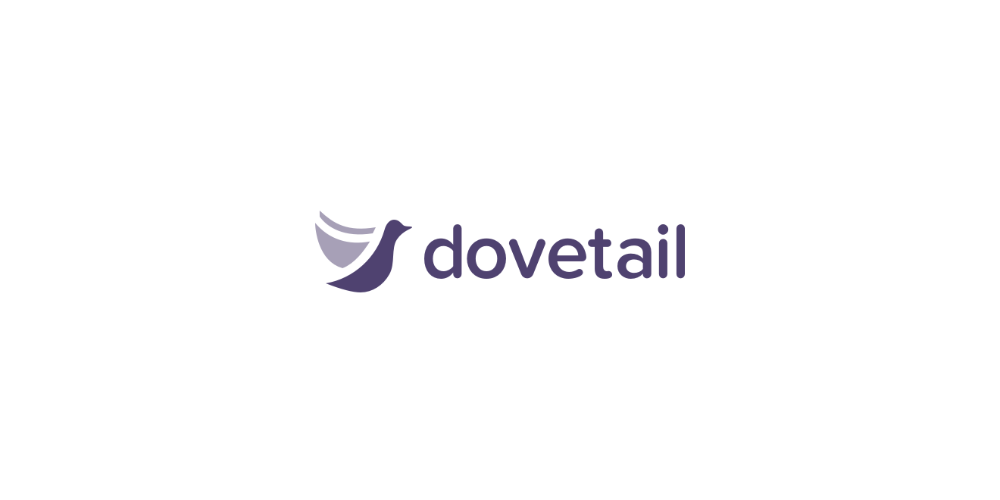
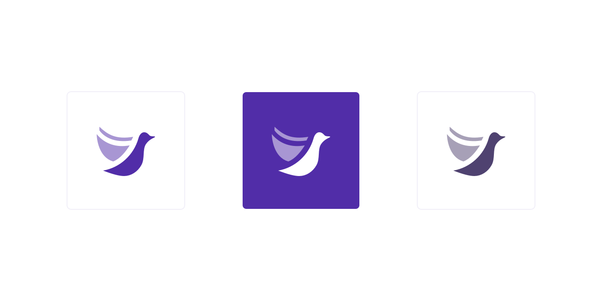
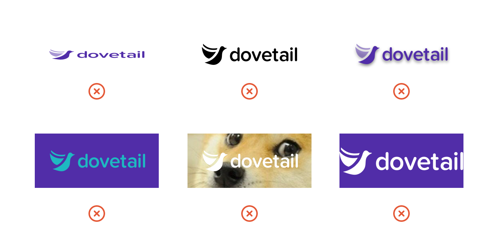

If you’re on this page, then perhaps you’re interested in writing about Dovetail or including our logo on your website or in a slide deck. Or maybe something else entirely. Whatever you’d like to do, we’d love to support you in sharing Dovetail, making it as easy as possible to get the right files and founder photos.

## Download

The press kit contains logos in a variety of formats, founder photos, and a short slide deck containing an overview of our product.

**[Download dovetail-press-kit.zip](./dovetail-press-kit.zip)**

## Logo usage examples

The logo works best in Purple (#512DA8) on a solid white background:

If you’d like to invert the colors, use a white logo on a Purple (#512DA8) background:

If you need to greyscale the logo, please use Indigo 80 (#4F4270) on white:

Likewise, the same rules apply for logomarks alone:

Always leave space around the logo.

## Don’t do this

Please don’t stretch or distort the logo, use it with an unapproved color, remove the opacity on the dove’s wings, add drop shadows, or use it on top of a complicated background image or in a space where there’s not enough room:

