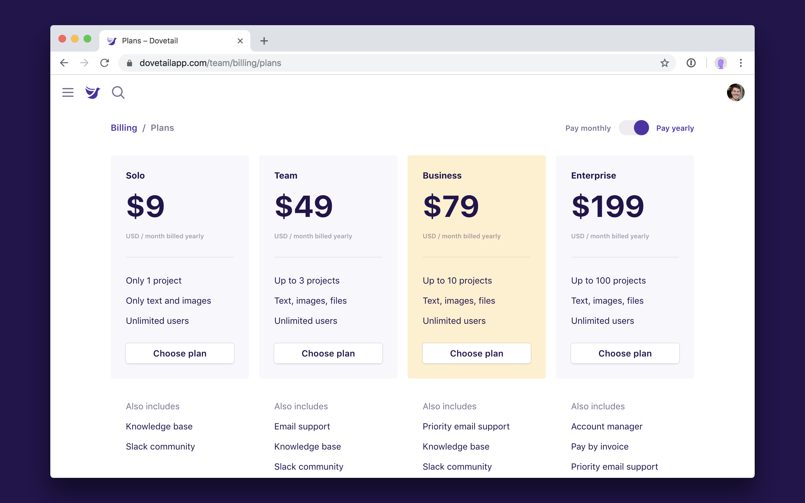
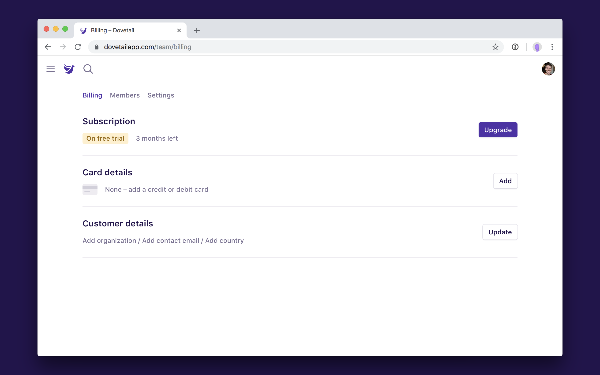
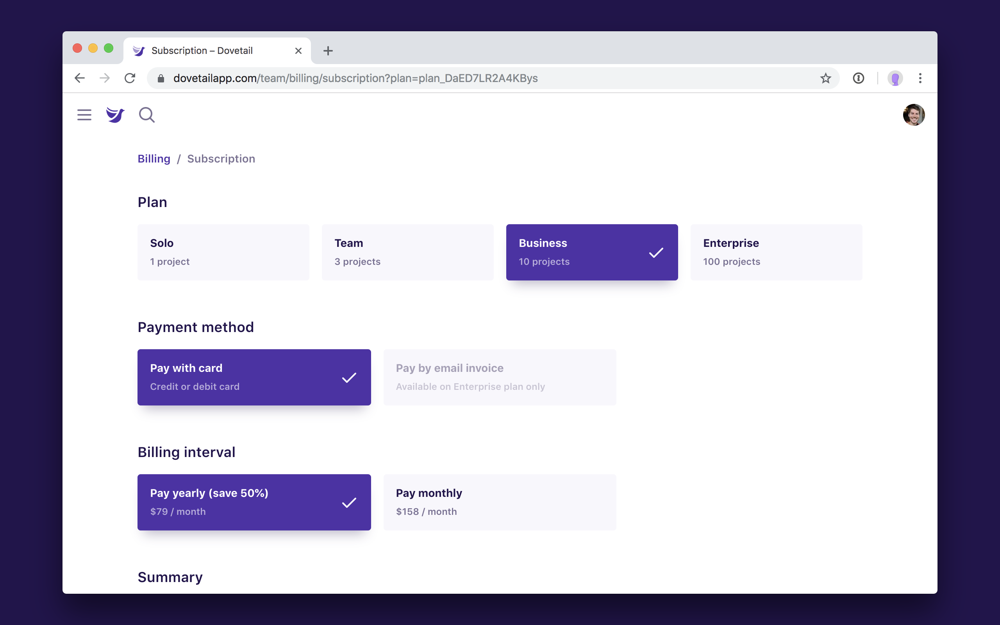
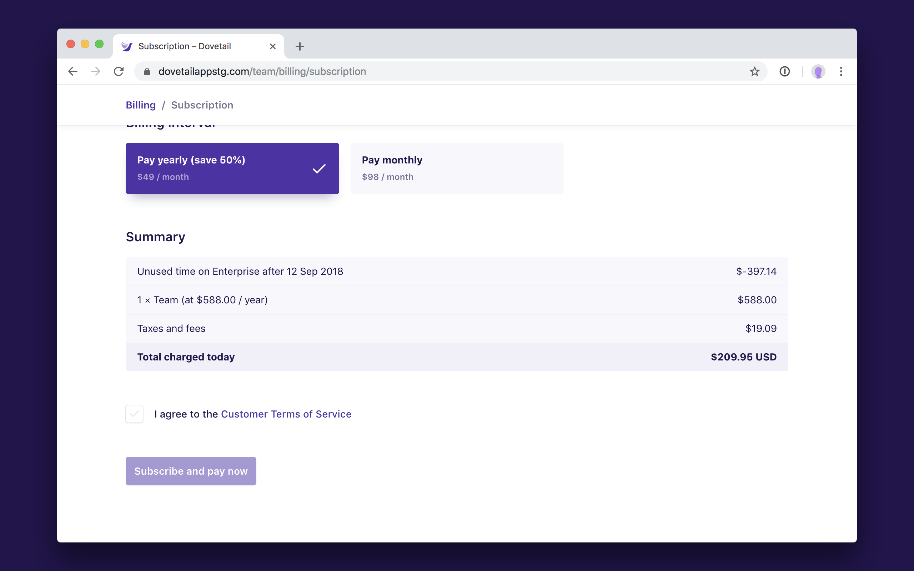

Dovetail has four pricing plans that you can subscribe to. Check out [the pricing page on our website](https://dovetailapp.com/pricing) or in-product for details on each plan.

You can upgrade to a paid subscription at any time during your free trial, or at any time after your free trial has expired. You can also manage your subscription, update your credit card, change the billing email address, switch your billing interval, and more.

Here’s what you need to know about our paid subscriptions:

- There are [four plans available](https://dovetailapp.com/pricing), starting from $9 USD / month.
- You can choose to pay monthly or yearly. Yearly includes a 50% discount.
- You can choose to pay via invoice instead of credit card on our ‘Enterprise’ plan.
- You can change plans at any time and we’ll prorate the difference.
- You can cancel at any time, which takes effect at the end of the billing period.

Questions? Check out our [Pricing FAQ](https://dovetailapp.com/pricing).

## Upgrade to a paid subscription

To upgrade your team to a paid subscription:

1.  Visit the **[team billing page](/team/billing)**.
1.  Next to **Subscription**, click **Upgrade** and choose a plan.
1.  Choose a **payment method**.
1.  Choose a **billing interval**.
1.  Agree to the **[Customer Terms of Service](https://dovetailapp.com/legal/customer-terms)**.
1.  Click **Subscribe and pay now**.

## Manage your subscription

You can upgrade or downgrade your plan, switch your billing interval, or your payment method from the subscription management screen.

**Note:** We will prorate the difference if you decide to change your plan in the middle of a billing period. For example, if you upgrade to a new plan, you’ll need to pay more to make up the difference. If you downgrade, we’ll use any existing credit.

A summary of any proration will be shown at the bottom of the subscription page:

To manage your subscription:

1.  Visit the **[team billing page](/team/billing)**.
1.  Next to **Subscription**, click **Manage**.
1.  Change your plan, payment method, or billing interval.
1.  Agree to the **[Customer Terms of Service](https://dovetailapp.com/legal/customer-terms)**.
1.  Click **Subscribe and pay now** to save.

## Update your card details

If you’ve set your subscription payment method to ‘pay by card’, then we’ll charge the card on file at the start of each billing period (month or year). Please ensure your card details are kept up to date and that you have sufficient funds.

To update your card details:

1.  Visit the **[team billing page](/team/billing)**.
1.  Next to **Card details**, click **Update**.
1.  Enter your name as it appears on the card, and billing address.
1.  Enter your credit card number, expiry, and CVV.
1.  Click **Update credit card** to save the new details.

## Update customer details

Customer details includes your organization name, billing email, and country. This information is used for tax purposes and the email address is where payment receipts, pricing updates, and other important announcements are sent.

To update your customer details:

1.  Visit the **[team billing page](/team/billing)**.
1.  Next to **Customer details**, click **Update**.
1.  Update your organization name, email address, or country.
1.  Click **Save**.
