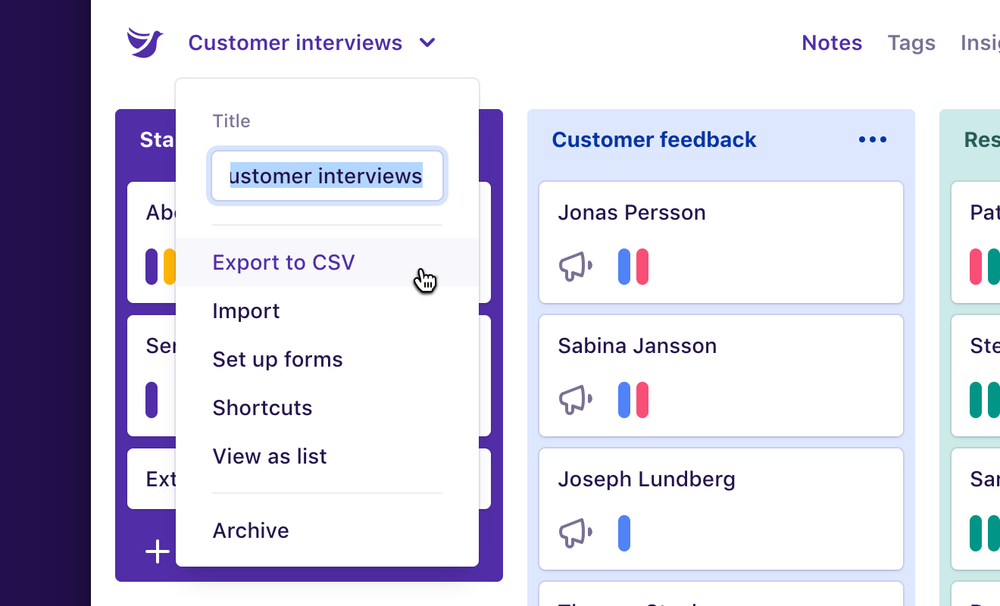
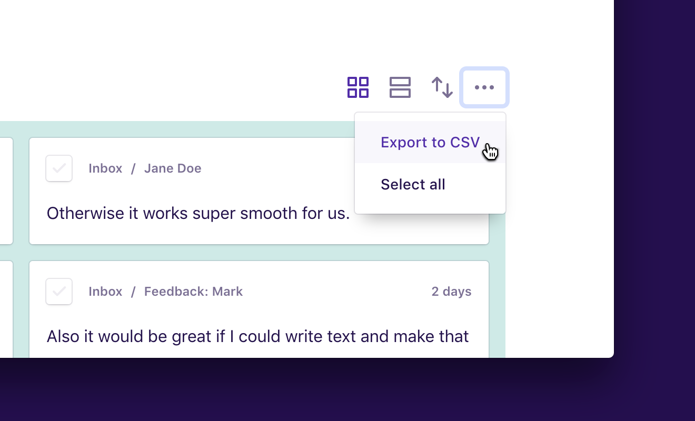

You can download a spreadsheet of highlights for your entire project, or only highlights for a specific tag or insight. Each spreadsheet contains a number of columns in the CSV format, and can be opened with Apple Numbers, Google Sheets, Microsoft Excel, or other spreadsheet software.

## Export all highlights

This spreadsheet includes all highlights for all tags or insights in a project.

To download a spreadsheet of all highlights in a project:

1.  Open a project.
1.  Click the **project title** near the top left.
1.  Click **Export to CSV**.

## Export some highlights

This spreadsheet includes all highlights for a specific tag or insight.

To download a spreadsheet of highlights for a tag or insight:

1.  Open a tag or insight with highlights.
1.  Click the **Actions (···)** menu to the right of **Highlights**.
1.  Click **Export to CSV**.

If you would like to sort your export before downloading, use the **Sort highlights** button to the left of the **Actions (···)** menu, then click **Export to CSV**.
