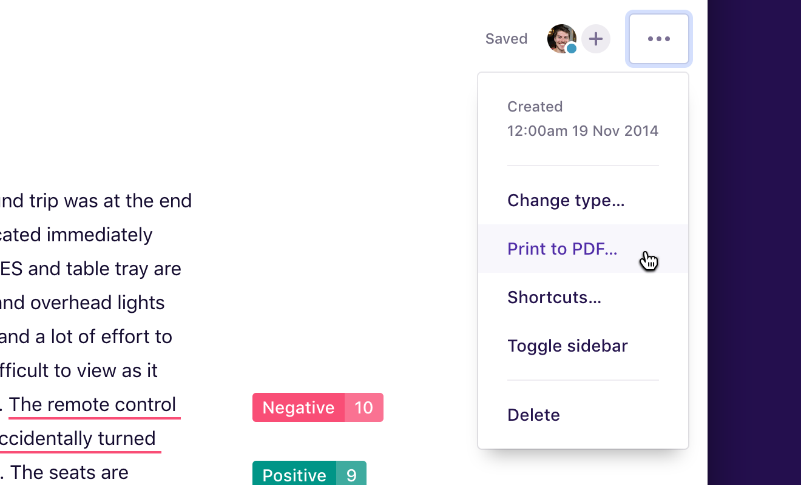

You can download a single note or insight as a PDF.

We’ve chosen PDF for notes because it’s the only semi-standardized format that preserves selectable text along with formatting, layout, and highlights.

To save a note or insight as a PDF:

1.  Visit the note you’d like to save
1.  Click the **Actions (···)** menu near the top right
1.  Click **Save as PDF…**

---

We’re always interested in hearing about other export options you’d like. Let us know by clicking **Feedback** in-product or by [emailing us](mailto:hello@dovetailapp.com).
