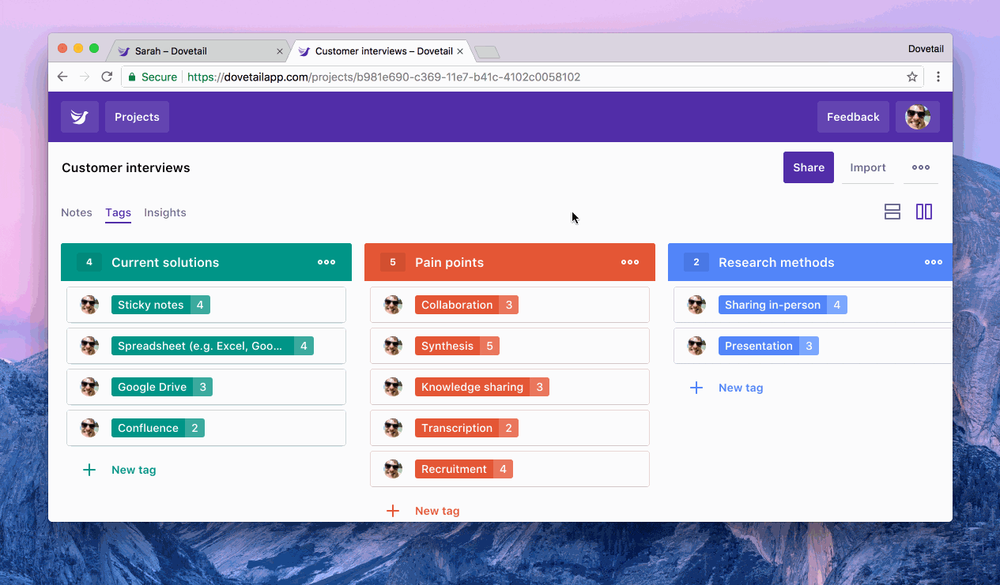

Dovetail supports exporting individual notes and insights, along with all unique annotations you’ve created in a project.

## Exporting annotations

You can download all unique annotations as a spreadsheet (CSV). The spreadsheet includes the following columns: Created, Title, Color, Group, Type, Note group, Note, Text, and a deep link URL.

To download a spreadsheet of all annotations:

1.  Visit your project
1.  Click the **More** menu (three dots) near the top right
1.  Click **Export as CSV**

## Exporting notes and insights

You can download a single note or insight as a PDF. We’ve chosen PDF for notes because it’s the only semi-standardized format that preserves selectable text along with formatting, layout, and highlights.

To save a note or insight as a PDF:

1.  Visit the note you’d like to save
1.  Click the **More** menu (three dots) near the top right
1.  Click **Save as PDF…**

## More exporting options

We’re always interested in hearing about other data export options you’d like us to support. Please let us know by clicking the **Feedback** button in-product, or by emailing us at [hello@dovetailapp.com](mailto:hello@dovetailapp.com).
