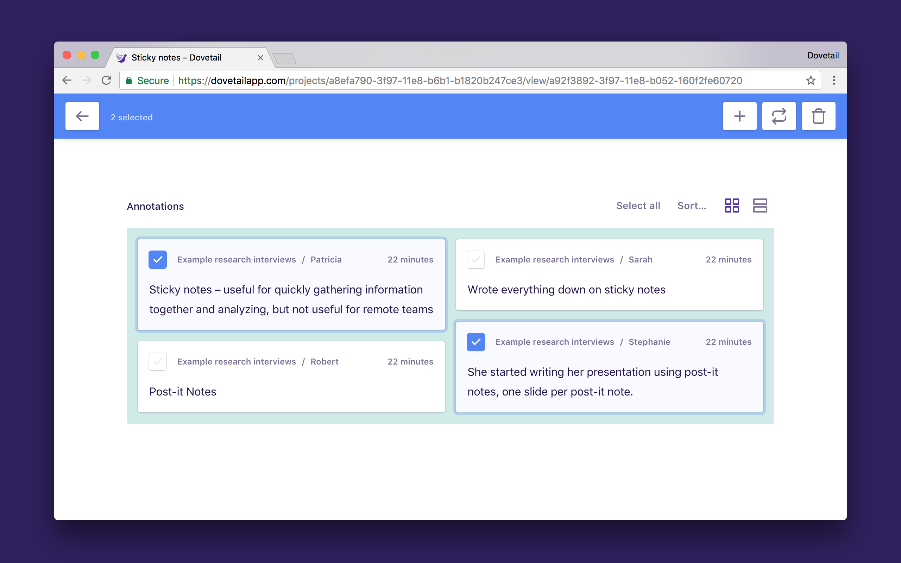

Dovetail offers a powerful annotations bulk editing mode to help you move annotations around and re-organize your tags and insights. Using bulk editing, you can merge two tags or insights together, add annotations to insights, or remove a tag or insight from multiple annotations at once.

To enter bulk editing mode, visit a tag or insight and click the checkbox on an annotation card. The blue bulk editing header will appear at the top of the screen. To cancel what you’re doing, click the back arrow in the top left of the screen.

## Add a tag or insight to multiple annotations

1.  Click the checkbox on the first annotation you’d like to modify.
1.  Select other annotations, or hold **Shift** and click to select a range.
1.  Click **Plus (+)** in the top right of the bulk edit header.
1.  Type to select an existing tag or insight, or create a new one.
1.  The tag or insight you choose will be added to the selected annotations.

## Replace the tag or insight with another one

1.  Click the checkbox on the first annotation you’d like to modify.
1.  Select other annotations, or hold **Shift** and click to select a range.
1.  Click **Replace** in the top right of the bulk edit header.
1.  Type to select an existing tag or insight, or create a new one.
1.  For the selected annotations, the current tag or insight will be replaced with the one you chose.

## Remove the tag or insight from multiple annotations

1.  Click the checkbox on the first annotation you’d like to modify.
1.  Select other annotations, or hold **Shift** and click to select a range.
1.  Click **Remove** in the top right of the bulk edit header.
1.  The current tag or insight will be removed from the selected annotations.
