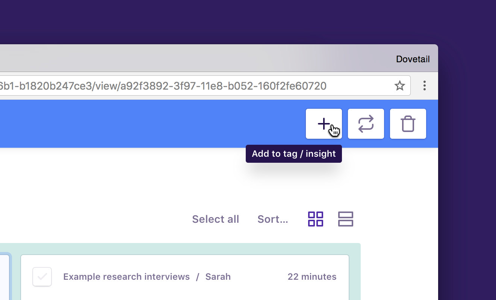
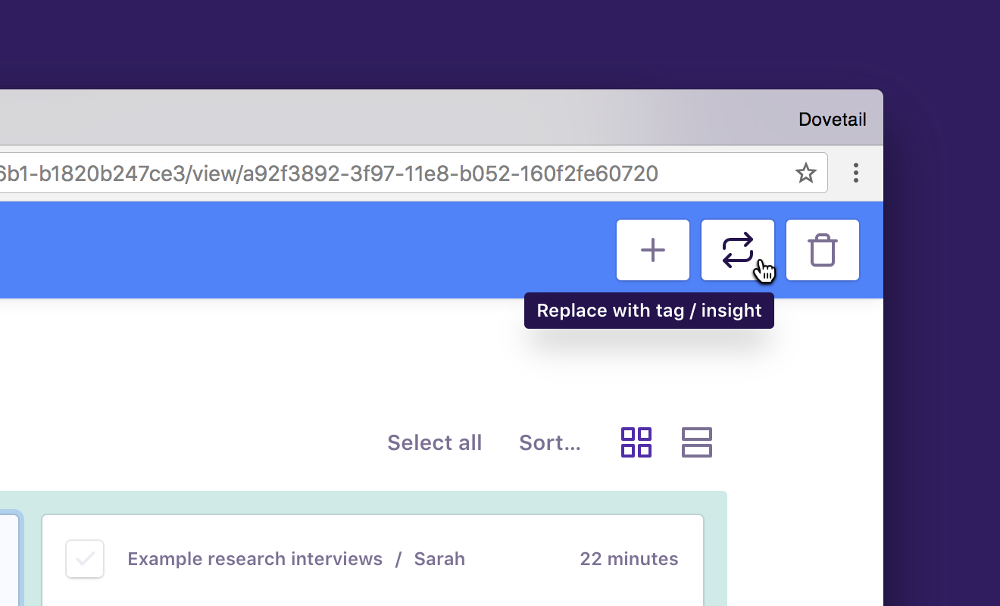
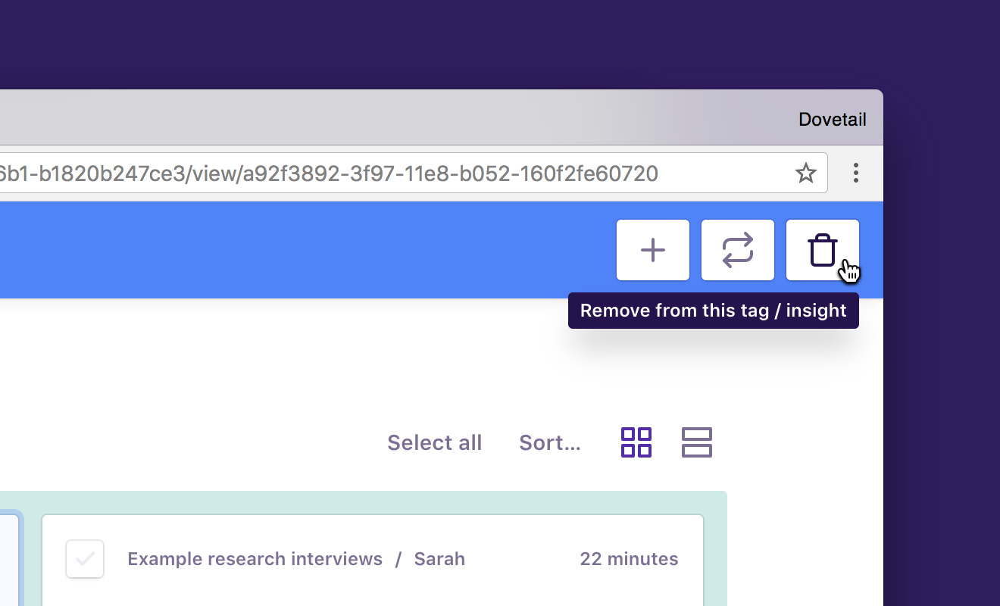

Dovetail offers a powerful highlights editing mode to help you move highlights around and re-organize your tags and insights. Using bulk editing, you can merge two tags or insights together, add highlights to insights, or remove a tag or insight from multiple highlights at once.

To enter bulk editing mode, visit a tag or insight and click the checkbox on an highlight card. The blue bulk editing header will appear at the top of the screen. To cancel what you’re doing, click the back arrow in the top left of the screen.

## Add a tag or insight

To add another tag or insight to multiple highlights:

1.  Click the checkbox on the first highlight you’d like to modify.
1.  Select other highlights, or hold **Shift** and click to select a range.
1.  Click **Plus (+)** in the top right of the bulk edit header.
1.  Type to select an existing tag or insight, or create a new one.
1.  The tag or insight you choose will be added to the selected highlights.

## Replace the tag or insight

To replace the existing tag or insight with another one on multiple highlights:

1.  Click the checkbox on the first highlight you’d like to modify.
1.  Select other highlights, or hold **Shift** and click to select a range.
1.  Click **Replace** in the top right of the bulk edit header.
1.  Type to select an existing tag or insight, or create a new one.
1.  For the selected highlights, the current tag or insight will be replaced with the one you chose, and they will disappear from this screen.

## Remove a tag or insight

To remove the existing tag or insight from multiple highlights:

1.  Click the checkbox on the first highlight you’d like to modify.
1.  Select other highlights, or hold **Shift** and click to select a range.
1.  Click **Remove** in the top right of the bulk edit header.
1.  The current tag or insight will be removed from the selected highlights, and they will disappear from this screen.
