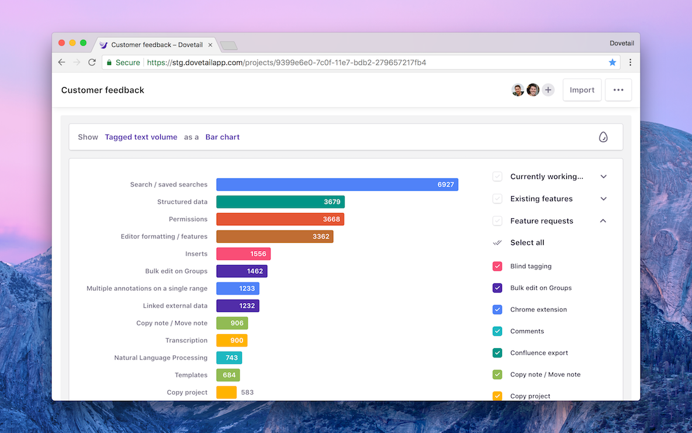

Understand your project at a glance by combining the power of annotations on qualitative data with a quantitative visualization as a bar chart or line chart.

In a project, click **Charts** to get started.

## Chart metrics

Dovetail’s charts can show three metrics, each of which give you a slightly different perspective on your data.

* **Annotations by tag.** This shows the total count of annotations created on notes. For example, if you have 6 notes and across those notes you’ve added 14 annotations, this would show 14.
* **Annotations by note.** This is very similar to annotations by tag however it will only count an annotation at most once per note. Using the example above, this would show 6 rather than 14.
* **Tagged text volume.** This shows the total character count per annotation. If your data is customer interview transcripts or user feedback, this metric can be useful to help you get an understanding of how much importance the subject places on this topic.

## Bar chart

The bar chart is the default visualization. It displays your selected metric at the current point in time. On the bar chart, tags are interactive. Just click on a bar to open that tag, however, note that bars showing groups are not interactive.

## Line chart

The line chart is historical. It shows your selected metric over time. This can help you see changes in your data over time.

For example, if you’re collecting user feedback, the line chart lets you keep track of increases or decreases in feature requests, or customer satisfaction through [automatic sentiment analysis](/help/sentiment).

## Filtering

To the right of the chart is the legend which is also an interactive filter.

By default, the chart will display bars or lines for each group of tags, determined by how you’ve organized your tags in the project’s **Tags** tab. These lines are roll-ups and add together all of the data from the tags inside the group.

Click the **expand** button to the right of a group to expand the group, then click **Select all** to show lines or bars for all the tags within the group. From here, you can also select or deselect individual tags to show on the chart.

## Data visualization options

There are several toggles to change how your data is presented. These can be found near the top right of the chart, above the legend / filters.

* **Use color from tag / group.** By default, chart colors come from a pre-determined array. This setting overrides that behavior and colors the lines or bars according to the actual color of your tag or group.
* **Use smoothed interpolation.** Line chart only. This switches between ‘jagged’ lines and ‘curvy’ lines. This one’s great for taking nice screenshots!
* **Use square root Y axis.** Line chart only. This switches between a linear axis and a square root axis. This improves readability with low volumes of data.
