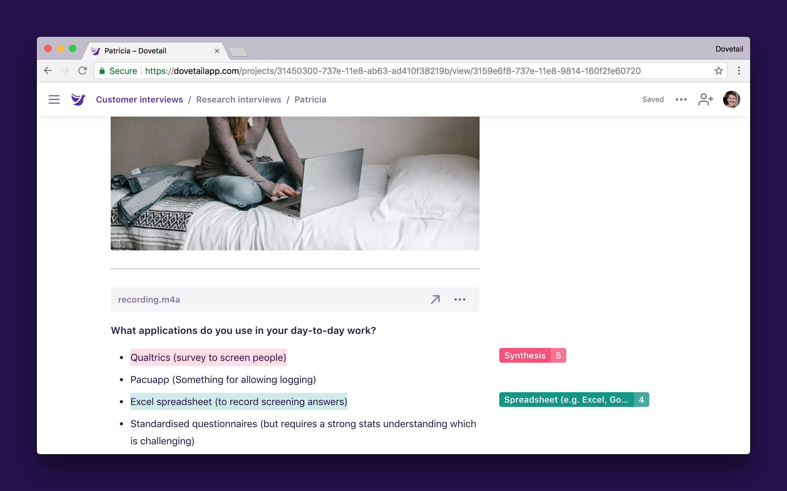

In Dovetail, notes represent your ‘raw data’. Depending on the context of your project, a note could represent many things. For example:

- Notes from a customer interview.
- Notes from a user testing session.
- Feedback imported from a [spreadsheet](/help/spreadsheet).
- A tweet from a [Zapier integration](/help/zapier).
- A research plan or runbook.

### Create a new note

Notes can be imported in bulk by [uploading a spreadsheet](/help/spreadsheet) or [connecting an integration via Zapier](/help/zapier).

You can also create new blank notes in projects:

1.  Open the **project** you’d like to create a note in.
1.  Click the **Notes** tab.
1.  At the bottom of a group, click **+ New note**.

### Edit notes

Dovetail’s editor is a rich text editor similar to Evernote or Microsoft Word. It supports common formatting like headings, bold, italic, quotes, bullet lists, numbered lists, tables, and more. For a complete list of available formatting, click the **Actions (···)** menu in the top right of a note, tag, or insight, then **Shortcuts**.

Like Google Docs, Dovetail also supports real time concurrent editing. If two or more people open the same note, changes to the content will be synced in real time. Highlights (tags and insights) are currently not synced in real time.
