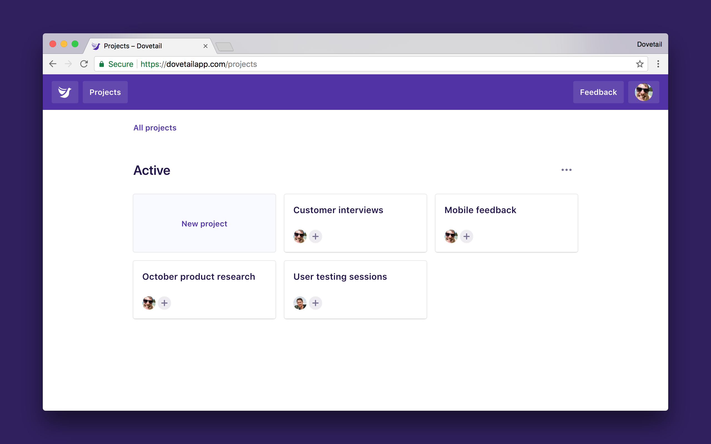
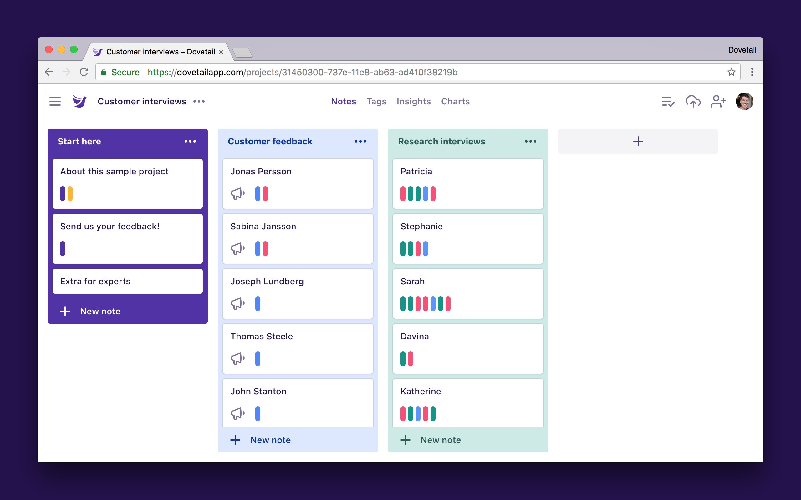
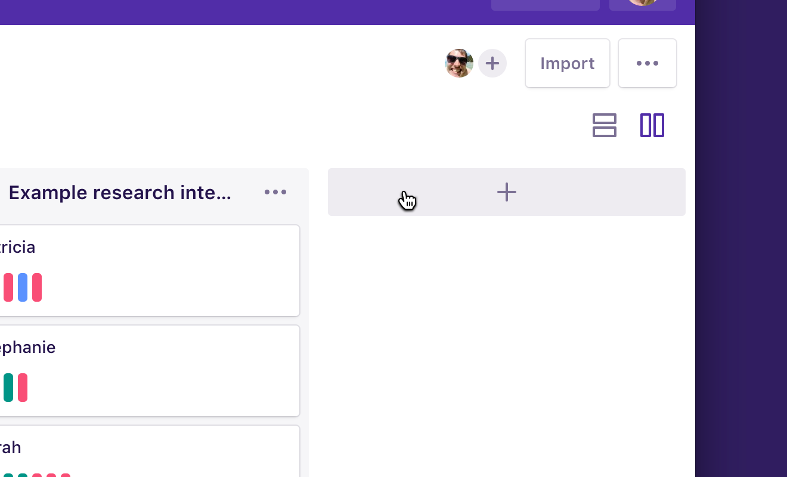
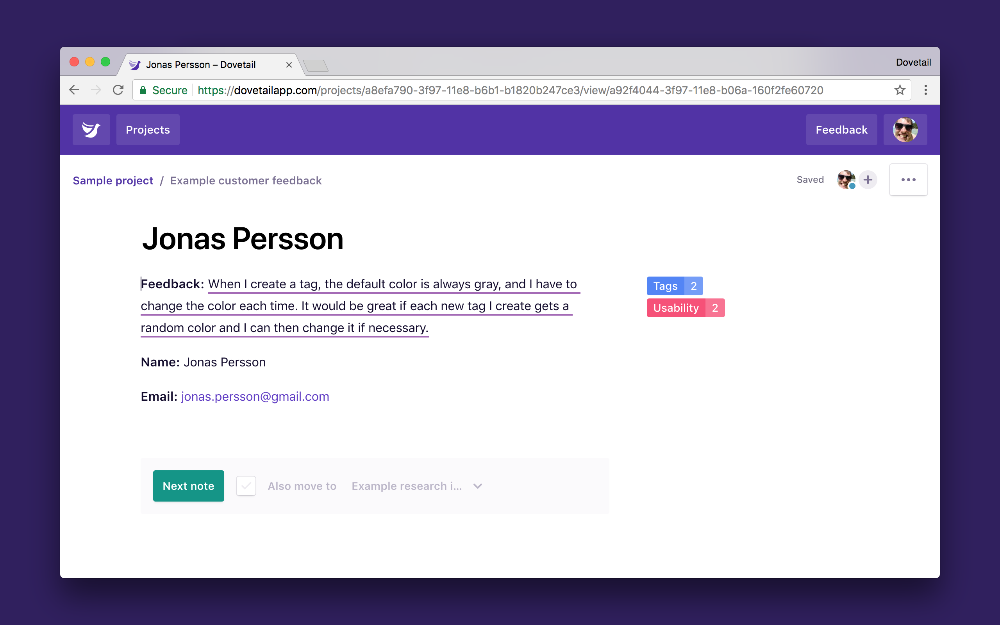
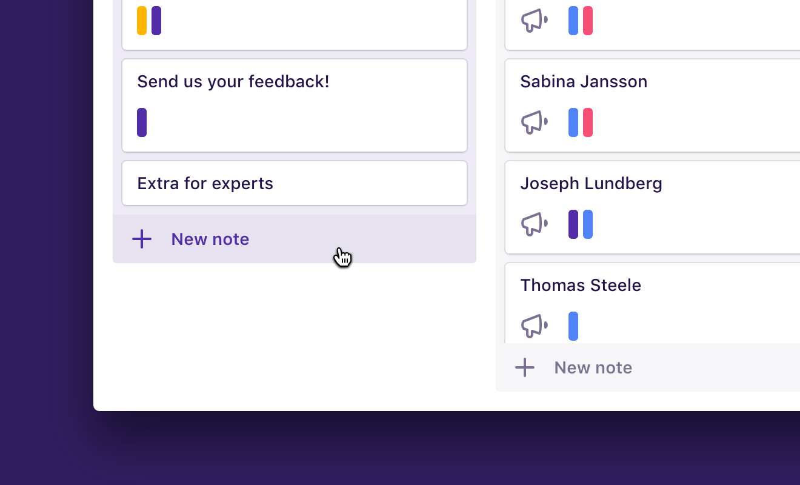

To get started with Dovetail, you’ll need to create a project. Projects contain groups of notes, tags, and insights, along with annotations and charts.

Teams, projects, groups, and notes / tags / insights exist in a hierarchy:

1.  Teams have many projects.
1.  Projects have many groups.
1.  Groups have many notes, tags, or insights.

## Projects

In Dovetail, projects can represent many things. For example, a project could contain:

* A set of customer interviews.
* A set of user testing sessions.
* A collection of ongoing user feedback.
* A collection of feedback from other apps.
* A large research project covering many methods.

### Create a new project

To create a new project:

1.  Click the **logo** in the top left to visit **[all projects](/projects)**.
1.  Click **New project**.
1.  Enter a **title** for your project near the top left of the screen.

## Groups

Projects have tabs to switch between notes, tags, insights, and charts. Each tab (except charts) contains groups for you to organize your content.

You can view groups as a **list** or a **board** by switching near the top right of the screen, and rearrange groups with drag and drop.

### Create a new group

To create a new group in a project:

1.  Click the **Notes**, **Tags**, or **Insights** tab.
1.  Click the **Plus (+)** at the end of the list or board.

## Notes

In Dovetail, notes represent your ‘raw data’. Depending on the context of your project, a note could represent many things. For example:

* Notes from a customer interview.
* Notes from a user testing session.
* A piece of feedback submitted through the [feedback form](/help/form-customize).
* A tweet from a [Zapier integration](/help/zapier).
* A research plan or runbook.

### Create a new note

Notes can be imported in bulk by [uploading a spreadsheet](/help/spreadsheet), [connecting an integration via Zapier](/help/zapier), or collecting feedback on your website through our [feedback form](/help/form-customize).

You can also create new blank notes in groups:

1.  Open the **project** you’d like to create a note in.
1.  Click the **Notes** tab.
1.  At the bottom of a group, click **+ New note**.
