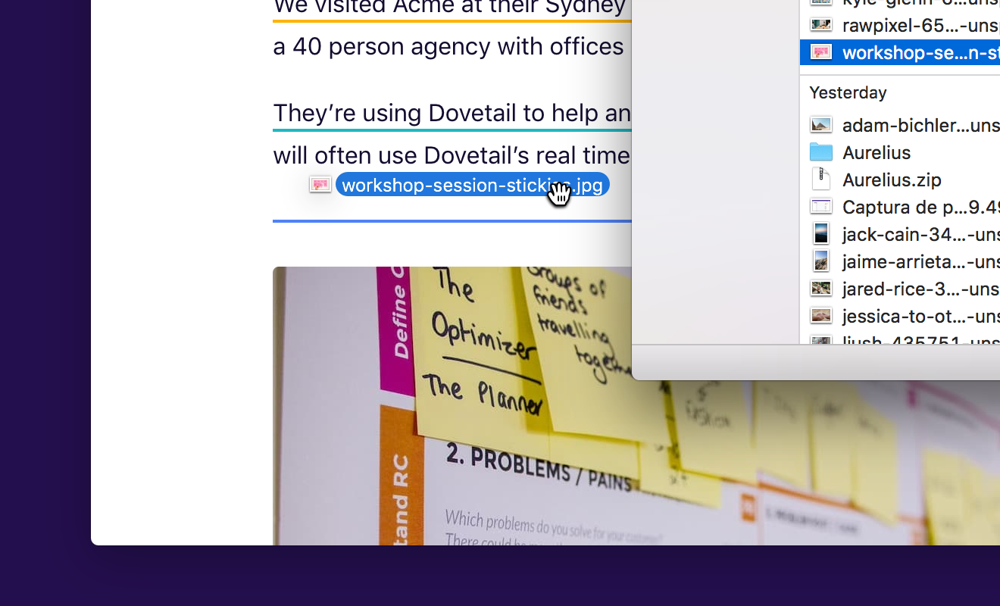
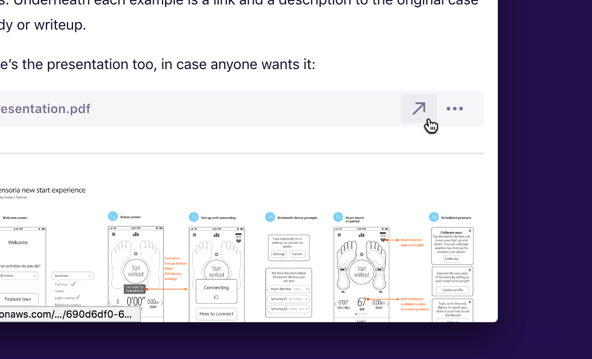

You can drag and drop files into Dovetail notes, tag descriptions, and insights. Simply select one or multiple files on your computer and drag them into the editor area:

Files appear straight away, but the upload happens in the background. You can continue working while your files are uploading; just don’t close your browser window.

### File types

Dovetail supports all files, however only images show previews. Feel free to add other files like audio, video, documents, spreadsheets, and zip files, but you’ll need to open these with your browser as Dovetail can’t open these file types.

### Opening and downloading a file

To download a file, click **Open** (Diagonal arrow) or click the **More menu**, then **Open**. Dovetail generates a secure access URL for you to open and download files. For security purposes, this URL expires after 15 minutes.

### Image previews

Dovetail will automatically generate image previews for JPEG, PNG, WebP, TIFF, GIF and SVG files. You can hide the image preview by clicking the **More menu** in the top right of an image, then choosing **Hide preview**.

### Managing files

You can copy and paste files between notes and projects and delete files by removing them from your note, tag description, or insight. Dovetail will keep track of where files are referenced and automatically delete files that have no references.

### File limits

Please see our [Technical limits](/help/limits) for information.

### Feedback

Send us your feedback on files! Email [hello@dovetailapp.com](mailto:hello@dovetailapp.com).
