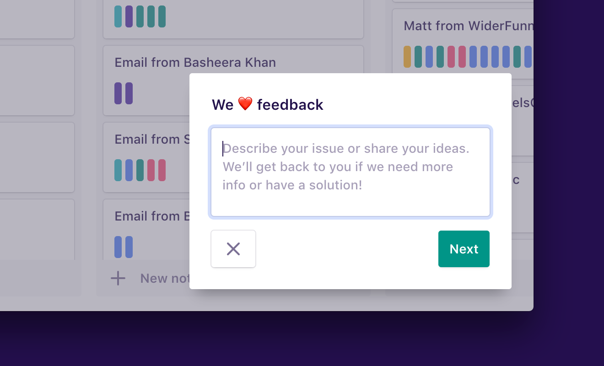
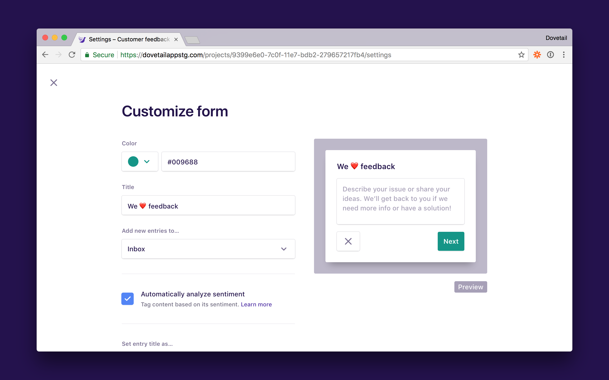

Gather valuable feedback from your users with a simple, customizable, and embeddable form. When people fill it out, their feedback is saved in your Dovetail project, ready to organize and analyze alongside everything else.

If you want to try this feature, just click the **Feedback** button in-product! We use our own embeddable feedback form to get feedback from our users.

## Create a new form

To create a new feedback form:

1.  In a project, click **Import**.
1.  Click **Embed a feedback form on your website**.
1.  Click **New form**.

## Customize your feedback form

To customize a form, click the **Customize** button on the form. You can customize the text, button labels, highlight color, and more.

## Customization options

**Highlight color.** Theme your form to match your website. Enter a valid HEX code or choose one of our colors from the dropdown.

**The form title.** Choose what to call your form.

**Where new entries are saved.** Select which project group you’d like to add new entries to, for example ‘Inbox’ or ‘Feedback’.

**Whether to analyze sentiment.** Dovetail can automatically analyze the sentiment of feedback created via the form. [Learn more]().

**What to set the note title as.** Choose whether to set the title for notes to the name or email address of the person submitting feedback.

**The form text.** Customize input labels and button text, or translate your feedback form to a different language for internationalization.

## Manage forms for a project

Each project can have multiple feedback forms with different customization options. This can be useful if you’d like to have a separate form for different features in your product or different sections on your website.

## Add the form to your website

[You’ll need to add some code to your website](/help/form-code). Once you’ve done that, customization changes will take effect immediately and you won’t need to update the code again.
