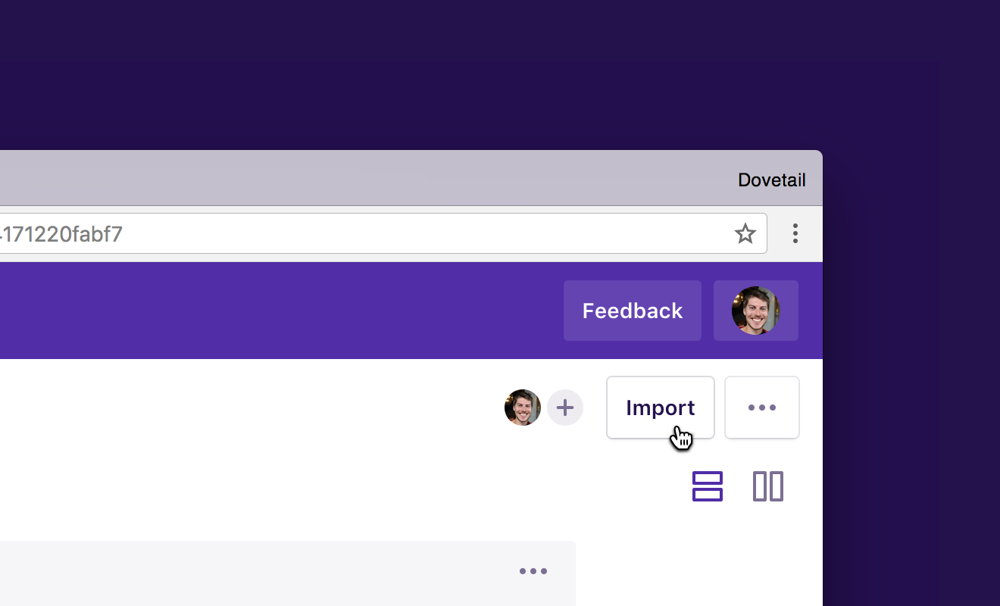
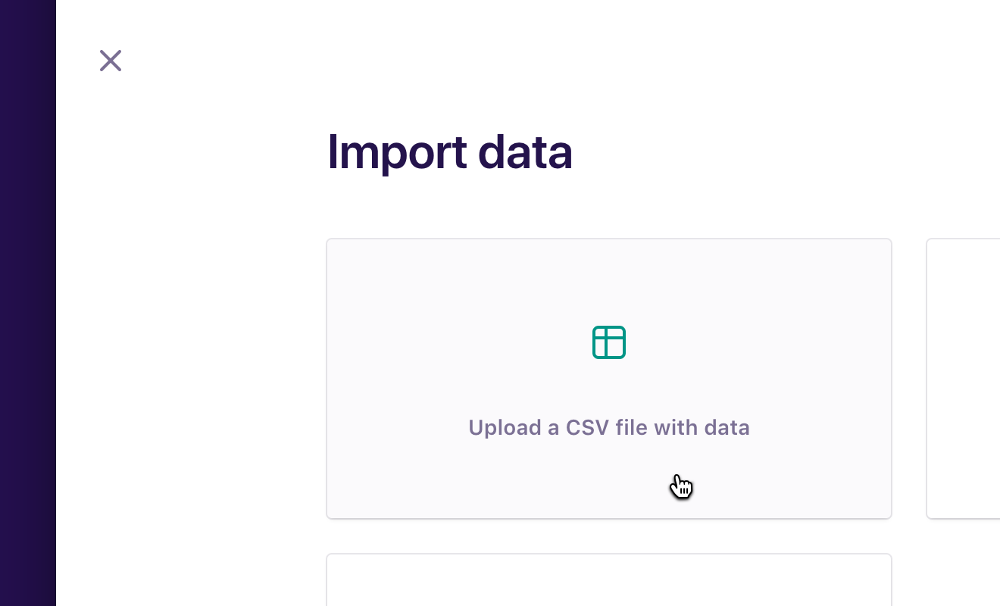
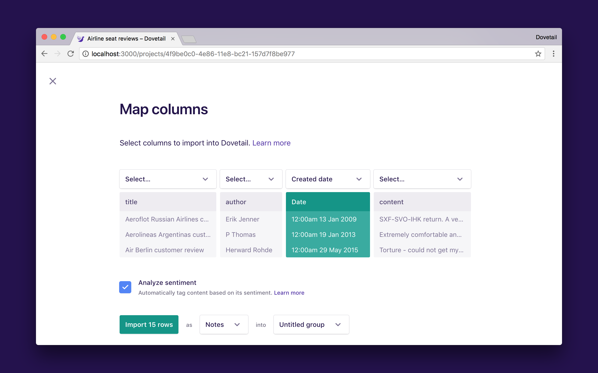
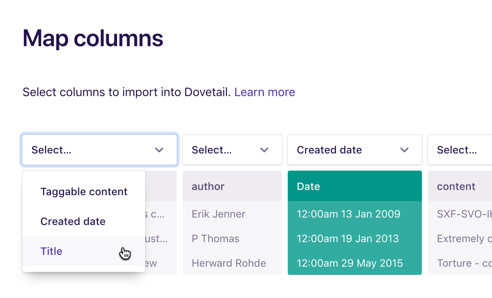
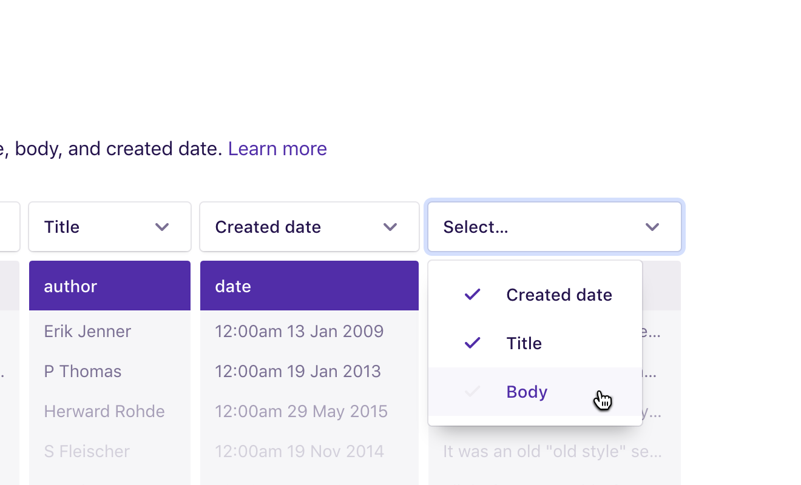
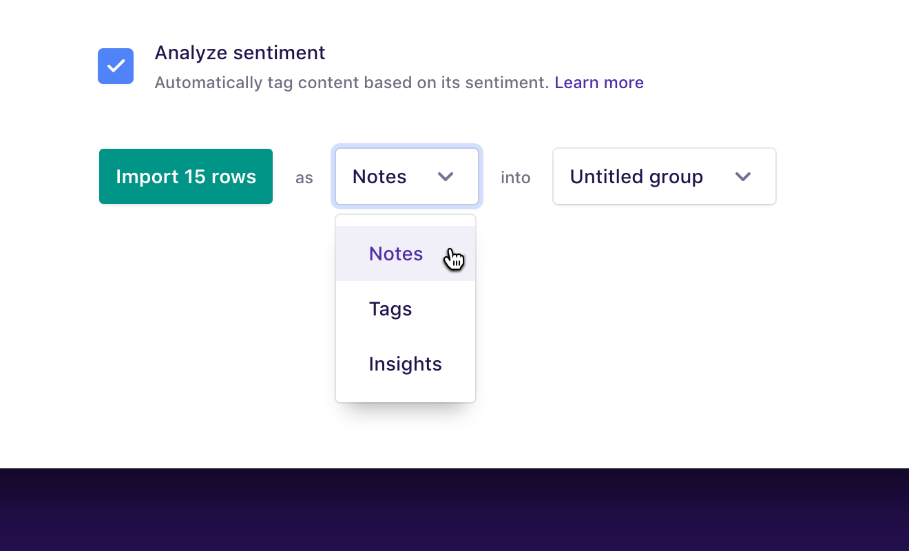
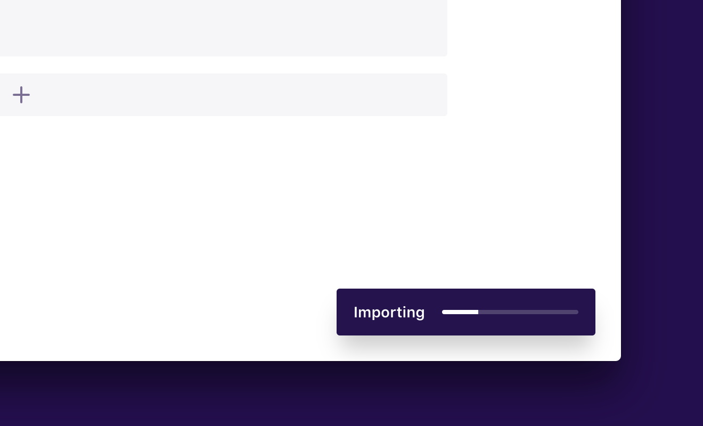
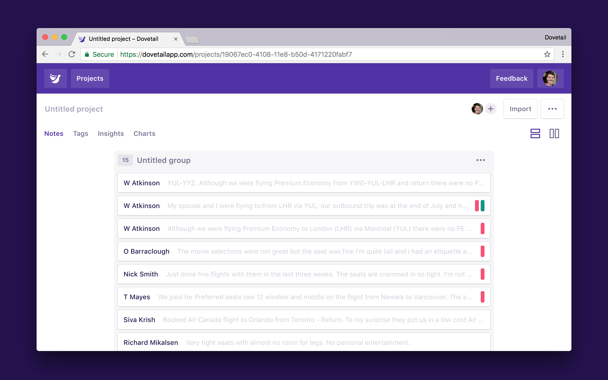
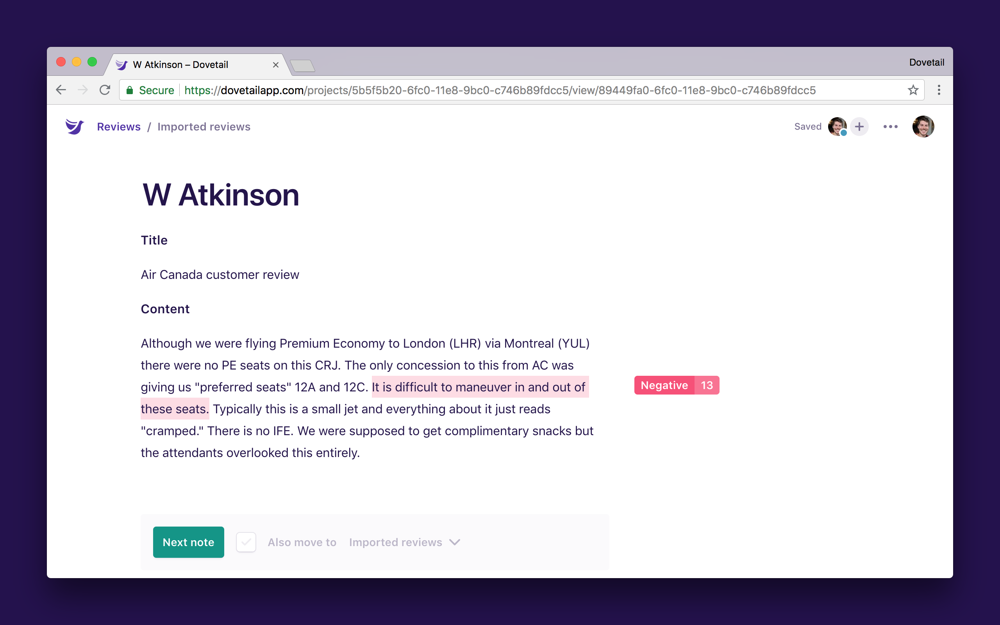

Create notes, tags, or insights in bulk from a CSV file. This is handy for importing data like NPS feedback, survey responses, and customer feedback to analyze in Dovetail, or if you have an existing set of tags you’d like to import.

**Note:** CSV import is primarily designed for creating lots of small—to—medium notes.

## Preparing your file for import

You’ll need a sheet from [Microsoft Excel](https://support.office.com/en-us/article/Import-or-export-text-txt-or-csv-files-5250ac4c-663c-47ce-937b-339e391393ba), [Google Sheets](<(https://support.google.com/docs/answer/49114)>), or [Numbers](https://support.apple.com/en-au/HT205391) saved as a UTF-8 encoded Comma Separated Value (CSV) file.

The first row needs to be the title of each column. For example, if you’re importing survey responses, the first row should contain values like Name and Email, along with your questions like “Why did the chicken cross the Möbius strip?” and so on.

(The answer is “to get to the same side.”)

## Supported fields

### Taggable content

You can map this field to multiple columns. We support all UTF-8 characters, including emoji, and the limit for content is 100,000 characters. This is a required field for notes and insights, but not tags.

### Created date

You can map this field to one column. We recommend the [ISO 8601](https://en.wikipedia.org/wiki/ISO_8601) date format, otherwise YYYY/MM/DD HH:MM. This is an optional field.

### Title

You can map this field to one column. We support all UTF-8 characters, including emoji, and the limit for the title is 200 characters. This is an optional field.

## Importing your data

### Choose your file

Once you’ve got your CSV file ready, open the project you’d like to import your data into and click **Import data** near the top right of the screen:

Click **Upload a CSV file with data** and choose a .csv file from your computer:

### Map columns

Select columns to import from your spreadsheet. If your spreadsheet contains a date column, Dovetail might have already detected it, and it’ll be green:

Decide which column to set as the title. Open the **select menu** and choose **Title**:

Next, choose the columns to import as content. These columns will import as the taggable content of the note or insight, or the description for tags.

Open the **select menu** and choose **Taggable content** for one or many columns, and repeat until you’ve mapped as many columns as you need:

### Sentiment analysis

If you’d like to analyze the sentiment of your data, keep the **Analyze sentiment** checkbox checked. Dovetail will add ‘Positive’ and ‘Negative’ tags to content that expresses a strong positive or negative sentiment.

[Learn more about automatic sentiment analysis](/help/sentiment)

### Select how to import the data

Open the **select menu** after ‘as’ and decide whether you’d like to import your data as notes (default), tags, or insights. Also open the **select menu** after ‘into’ and choose what group to put the imported data in.

### Start the import

Click **Import rows** to start the import. Dovetail will import the green columns for all the rows. You can see the progress of your import in the bottom right corner:

Once the import has finished, click **Refresh** to see everything you’ve imported:

Open a note and you’ll see the columns you chose for taggable content are appended to the note with headings, along with sentiment analysis tags, if any:

That’s it!

## Troubleshooting

Here are a few things to note about CSV import:

* Formatting like headings, bold, italics, lists, tables, and images are not supported when importing from a CSV. They may cause a failure.
* The maximum length for notes in Dovetail is 100,000 characters. No single cell in your CSV file should exceed this limit. This will cause a failure.
* Dovetail will interpret two newline characters as separate paragraphs.
* Your file needs to be encoded as UTF-8 (this is usually the default).
* Your CSV file should end in a .csv file extension.
