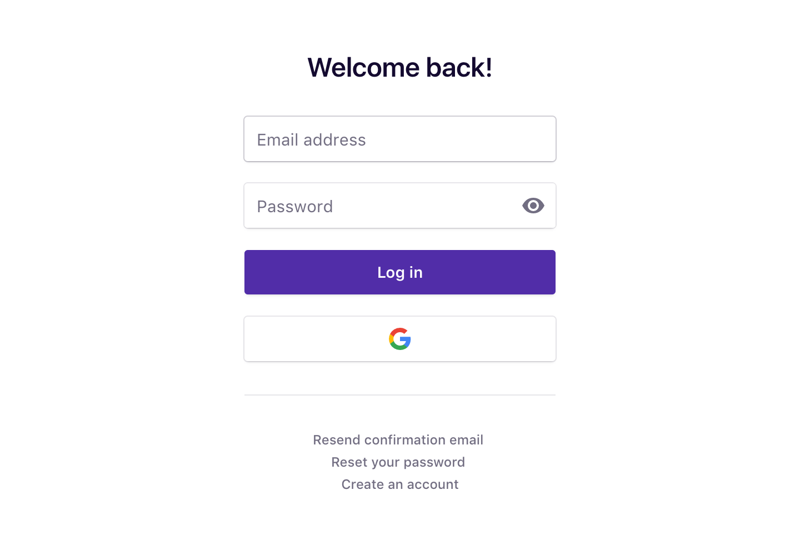

Our [Zapier](https://zapier.com/) integration lets you connect 1,000+ apps and services to Dovetail to centralize your research data and customer feedback in one place. For example, here are a few common use case for integrations:

* **Send @mentions to Dovetail** – When you’re mentioned on Twitter, save the tweet as a new note in Dovetail.
* **Save Typeform survey responses to Dovetail** – When someone responds to a question in a Typeform survey, append their answer to a note.
* **Save Intercom conversations in Dovetail** – When a new conversation is created in Intercom, save it as a note in Dovetail.

## Connect Dovetail & Zapier

The first thing you’ll need to do is connect to Zapier. If you haven’t got a Zapier account yet, sign up for free at [zapier.com](https://zapier.com/). When you start creating the integration you want, Zapier will ask you to connect Dovetail:

Click **Connect an Account** and you’ll be prompted to log in to Dovetail if you aren’t already logged in:

After logging in, you’ll need to approve Zapier’s request to access your Dovetail account. Just click **Approve** to continue:

Finally, the window will close and your Dovetail account will be connected with Zapier. If everything is good to go you’ll see this screen:

The next step is to continue setting up your Zap. [Zapier’s documentation](https://zapier.com/help/zap-creation/) has detailed instructions on how to continue.

## Having problems?

[Contact us](mailto:hello@dovetailapp.com) and we’ll be happy to help.
