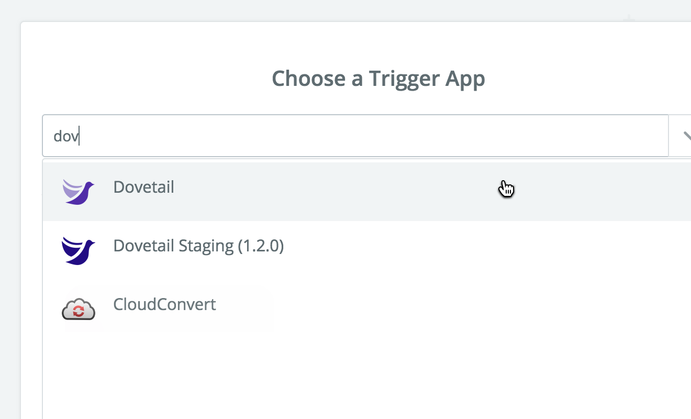
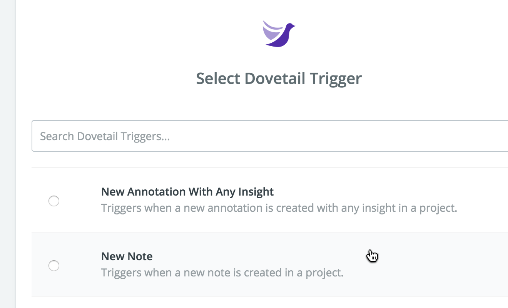

[Zapier](https://zapier.com/) lets you connect apps together and move data around using automated workflows. Our Zapier integration has five **Triggers** and three **Actions** to help you move data between Dovetail and the other apps you use, in both directions.

## Get started with Zapier

The first thing is to create a Zapier account if you don’t have one already. Sign up for free at **[zapier.com](https://zapier.com/)**, then click **Make a Zap!** in the top right corner to get started:

## Choose Dovetail as the Trigger App

Since we’ll be using Dovetail as the source for data, in the search input for **Choose a Trigger App**, type **Dovetail** and choose it from the list.

## Choose the Trigger to use

Dovetail supports five Triggers. Choose the Trigger you’d like to use, then click **Save + Continue**. For example, if you choose the ‘New Note’ Trigger, your workflow will run every time a new note is created in the project you select.

## Authorize Dovetail

Now authorize Zapier to be able to access data from Dovetail. Click **Connect an Account** and then click **Approve** in the popup window that appears:

Test the connection, then click **Save + Continue** to move on:

## Set up your action app

Once you’ve finished authorizing Dovetail and choosing your Trigger, you’ll be able to set up your Action App. This is the app you want to connect to Dovetail. With an Action App, you could save Dovetail insights as Trello cards, or back notes up to a Google Sheet.

Zapier supports 1,000+ apps. Check out their [directory](https://zapier.com/apps/integrations) and search for the apps you use.

## Having problems?

[Contact us](mailto:hello@dovetailapp.com) and we’ll be happy to help.
