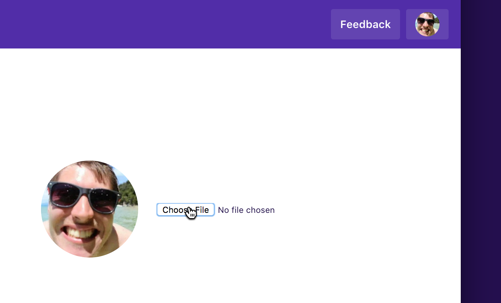
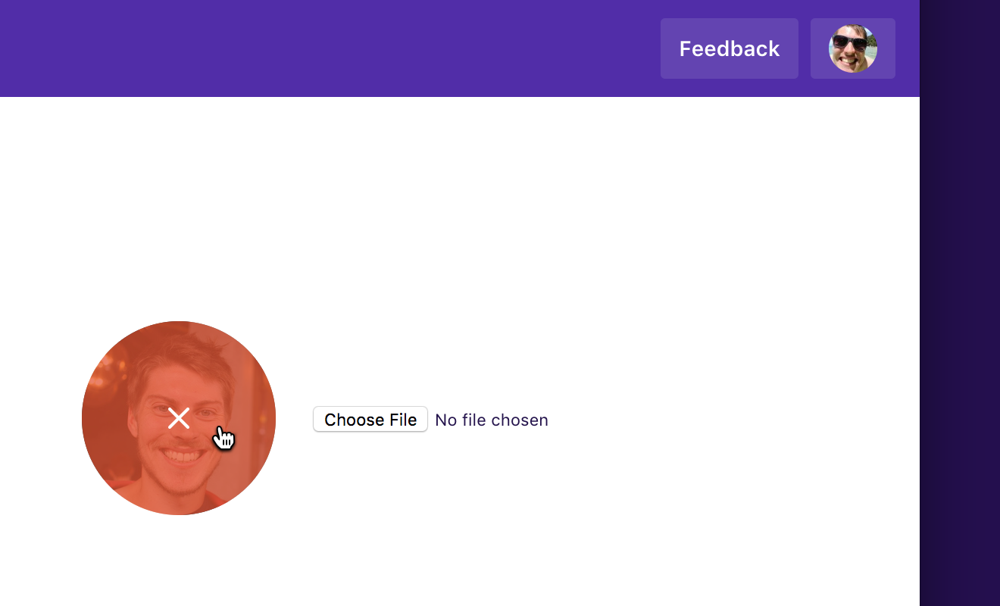

By default we use your [Gravatar](https://en.gravatar.com/) as your profile photo in Dovetail. To change your photo, you can change your gravatar or upload a new photo to Dovetail.

## Upload a photo

To upload a new photo:

1.  Visit [your profile](/profile) and click **Choose file**.
1.  Pick a **square image, no greater than 2 megabyes in size**.
1.  Wait a few seconds for your photo to update.

## Remove an uploaded photo

To remove an uploaded photo:

1.  Visit [your profile](/profile) and hover over your photo.
1.  Click **Remove (𝗫 icon)**.
1.  Wait a few seconds for your photo to update.
