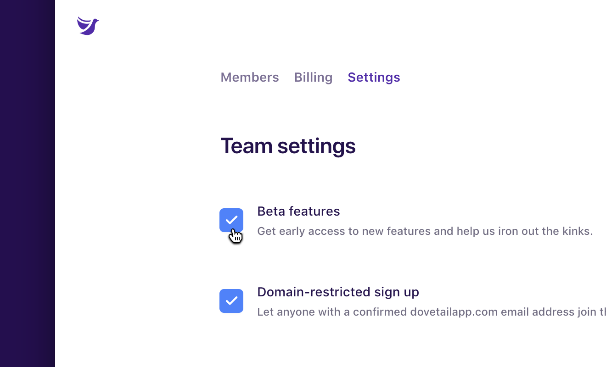

From time to time we will release new features in a beta program. Your team can help us test these new features. Please send us your feedback!

To enable beta features for your team:

1.  Click your profile menu in the top right.
1.  Click **[Team members](/team/members)**.
1.  Click the **Settings** tab.
1.  Check the **Beta features** checkbox.
1.  Refresh your browser window.
