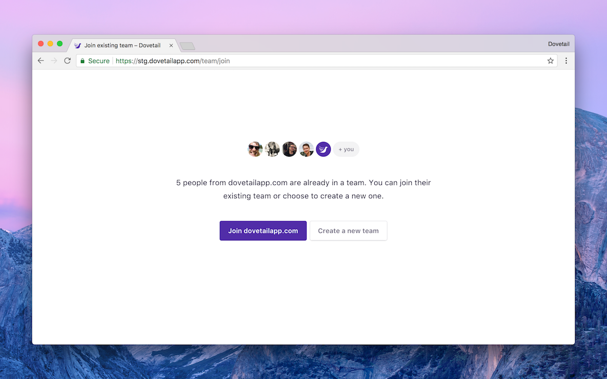

Domain-restricted sign up makes it easy for your colleagues to join an existing team. When someone with a verified email address from your domain signs up for Dovetail, they’ll be prompted to join your team as part of the sign up flow.

The following criteria must be met:

1.  Domain-restricted sign up is on for your team (enabled by default)
1.  Your team’s admin has a confirmed email address (e.g. admin@foo.com)
1.  The person signing up has a confirmed email address that exactly matches your team’s admin’s domain name (e.g. foo.com).

You can disable domain-restricted sign up in your [team settings]().

---

**Note:** Domain-restricted sign up will not be available if your admin has an email address from a free provider (e.g. gmail.com, yahoo.com).
