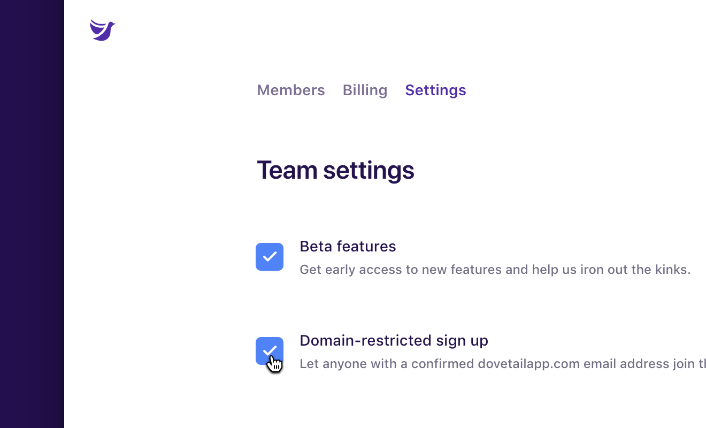

Domain-restricted sign up makes it easy for your colleagues to join an existing team. When someone with a confirmed email address from your domain signs up for Dovetail, they’ll be prompted to join your team as part of the sign up flow.

For example, let’s say you work for acme.com, and your email address is jane@acme.com. With domain-restricted sign up enabled, anyone who signs up for Dovetail with a confirmed email address ending in acme.com will be prompted to join your team.

For domain-restricted sign up to be available, the following criteria must be met:

1.  Domain-restricted sign up is on for your team
1.  Your team’s admin has a confirmed email address (e.g. jane@acme.com)
1.  The person signing up has a confirmed email address that exactly matches your team’s admin’s domain name (e.g. acme.com).

Domain-restricted sign up is on by default for all teams that meet the above criteria. You can disable domain-restricted sign up in your [team settings](/team/settings):

