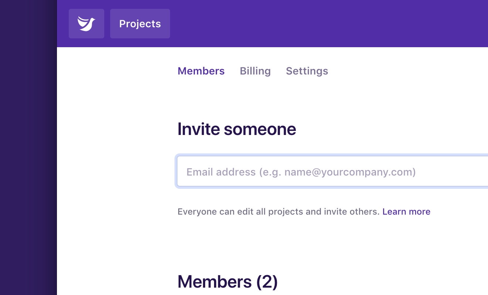

Anyone on the team can invite new people and it won’t affect your bill. We charge a fixed price per month for the whole team, regardless of how many members there are.

## Invite someone to your team

To invite someone to your team:

1.  Click your profile menu in the top right.
1.  Click **[Team members](/team/members)**.
1.  Under **Invite someone**, type an email address.
1.  Click **Send invite**.

## No invite emails?

If you’ve invited someone but they haven’t received an email, ask them to check their spam folder or company email policy. We’ve had cases where a company firewall has blocked our emails from reaching inboxes.

If you’re still having trouble, ask them to create their own account through [dovetailapp.com](https://dovetailapp.com), then invite them to your team after they’ve signed up. If they refresh their team page, they’ll see a message saying they’ve been invited to your team. They can then click a **Join team** to accept.
