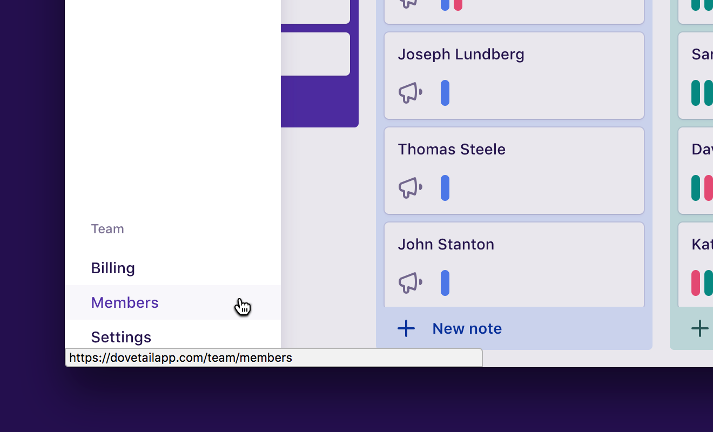

In Dovetail, every user must belong to a team. When you create an account on Dovetail, if you’re not joining an existing team, we’ll create a new team for you. You can then [invite other users](/help/invite) to join your team so it’s not so lonely.

Projects also belong to the team, not individual users. When a someone leaves a team (including yourself), any projects they created or contributed to will stay with the original team. In other words, when you change teams, by either leaving your team or accepting an invite to another one, you will lose access to all projects in your original team.

To manage your team, click the **Menu (☰)** in the top left, then click **Members**:

