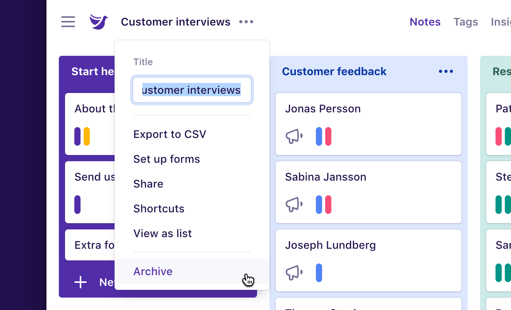

Completed projects can be **archived** to keep your list of projects tidy and signal to others that the project has ended. A few things to note:

* Archived projects can still be used like normal.
* Once a project is archived, a lozenge will appear next to the project title.
* Feedback forms and Zapier integrations will continue to work.
* Projects must be archived before they can be deleted.

## Archive a project

To archive a project:

1.  Open the project you’d like to archive.
1.  Click the **project title** near the top left.
1.  Click **Archive** at the bottom of the list.

To unarchive a project:

1.  Open the project you’d like to unarchive.
1.  Click the **project title** near the top left.
1.  Click **Unarchive** near the bottom of the list.
