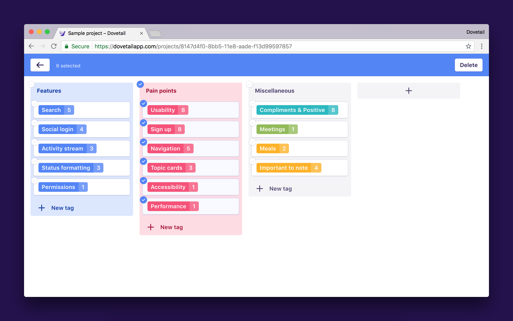

Dovetail offers a bulk editing mode to help you manage notes, tags, and insights within a project. Currently, bulk editing lets you delete multiple things at once, but in the future it will also let you copy, move, and rename multiple things at once.

## Enter bulk editing mode

1.  Near the top right of a project, click **Edit multiple**.
1.  Click the checkboxes to select items in the project.
1.  Click **Delete** to delete all the selected items.
