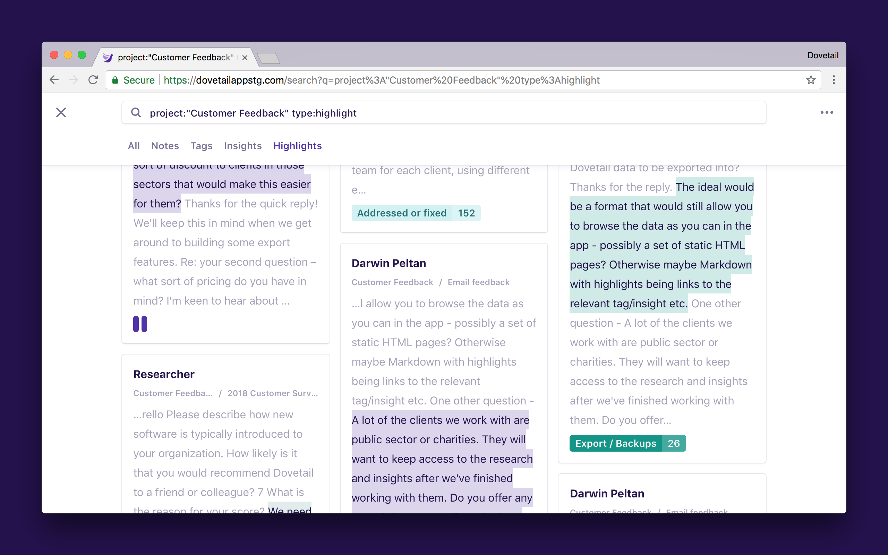
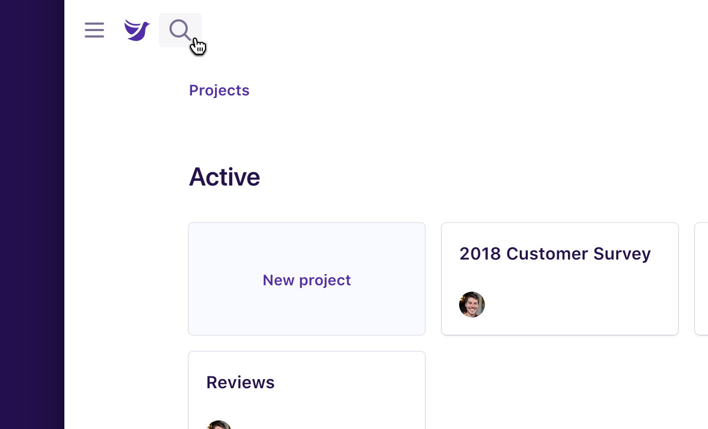
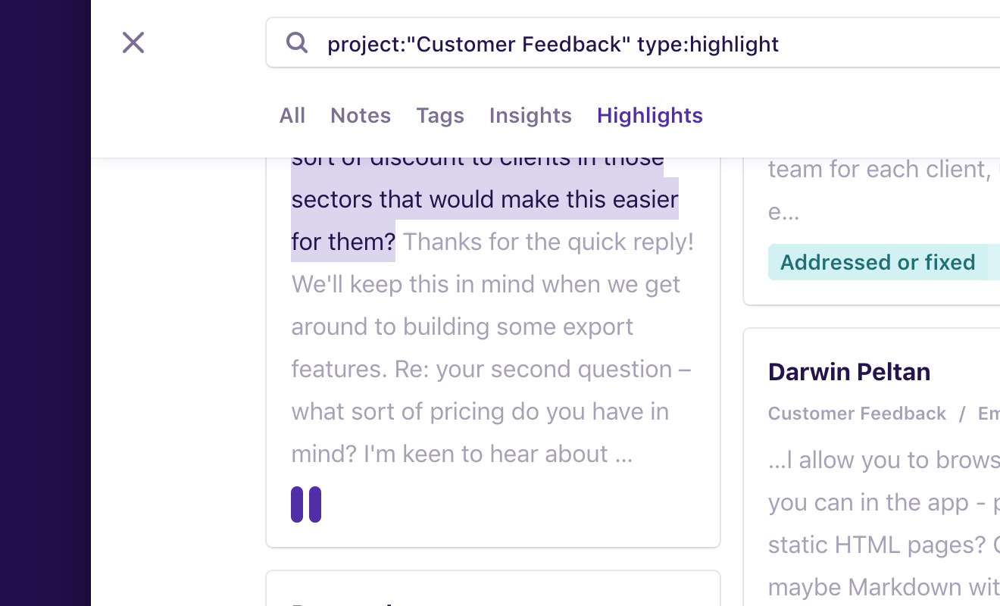

Dovetail’s full-text search experience includes a powerful query language called the Dovetail Query Language (DQL). DQL lets you create search queries to return results across projects, filtering by type, tags, and more.

Queries can be as simple as single words like `slow` or as advanced as more complex queries like `type:highlight project:feedback -tag:performance slow`.

## Get started

To start a new search, click the search icon in the top left of the screen.

By default search shows everything across all projects in your team.

Click the tabs underneath the search input to switch between notes, tags, insights, and highlights. You’ll notice the query in the input changes. For example, clicking **Highlights** will change the query to match on the field `type` with the value `highlight`.

## Search examples

Here are some examples of searches you could perform with DQL:

| Query                                                            | Returns…                                                                                                    |
| ---------------------------------------------------------------- | ----------------------------------------------------------------------------------------------------------- |
| **slow**                                                         | Everything with the word ‘slow’, across all projects in the team.                                           |
| **project:feedback slow**                                        | Everything with the word ‘slow’ in projects with the word ‘feedback’ in their title.                        |
| **project:"User feedback" slow**                                 | Everything with the word ‘slow’ in the ‘User feedback’ project.                                             |
| **type:note tag:twitter slow**                                   | Notes with the tag ‘twitter’ that contain the word ‘slow’ in the note title or body.                        |
| **type:tag slow**                                                | Tags that contain the word ‘slow’ in their title or description.                                            |
| **type:highlight project:"User feedback"**                       | Highlights in the “User feedback” project.                                                                  |
| **project:"User feedback" type:highlight -tag:performance slow** | Highlights in the ‘User feedback’ project containing the word ‘slow’ that don’t have the tag ‘performance’. |
| **-project:"User feedback" type:highlight**                      | Highlights in all projects except ‘User feedback’.                                                          |
| **-type:insight**                                                | All notes, tags, and highlghts, but not insights.                                                           |

## Field reference

DQL currently supports the following fields:

| Field        | Example             | Description                                                                            |
| ------------ | ------------------- | -------------------------------------------------------------------------------------- |
| **type**     | `type:highlight`    | Shows results by content type. Valid values: `note`, `tag`, `insight`, `highlight`.    |
| **project**  | `project:feedback`  | Shows results from a specific project.                                                 |
| **tag**      | `tag:usability`     | Shows results containing a specific tag.                                               |
| **-type**    | `-type:highlight`   | Excludes results by content type. Valid values: `note`, `tag`, `insight`, `highlight`. |
| **-project** | `-project:feedback` | Excludes results from a specific project.                                              |
| **-tag**     | `-tag:usability`    | Excludes results containing a specific tag.                                            |

## Match types

DQL supports two match types for field variables. These are fuzzy match and exact match. Fuzzy match returns anything containing the word, whereas exact match returns anything matching the exact phrase. Exact matching is case-insensitive.

For example, `project:feedback` would return results from two projects called ‘User feedback’ and ‘Manager feedback’, whereas `project:"user feedback"` would only return results from the ‘User feedback’ project.
